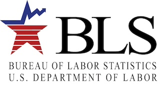

# Business Analyst / Data Analyst
[Linkedin](https://www.linkedin.com/in/danica-chin/)

#### Technical Skills: Python, SQL, R, Tableau, Power BI, Amazon QuickSight

## Education
- M.S., Business Analytics                     | California State Polytechnic University, Pomona (_August 2023_)
- B.S., Business Administration and Management | California State University, Long Beach (_May 2019_)

## Work Experience
**Graduate Student Researcher @ California State Polytechnic University, Pomona (_August 2021 – August 2023_)**
- Led a two-year thesis project, managing data collection and analysis to investigate misinformation spread
- Developed data structures and pipelines to organize, collect, cleanse, and standardize information for generating insights
- Presented research findings at academic conferences, demonstrating strong oral and written communication skills
- Ensured data integrity and quality by meticulously reviewing existing data sources

**Junior Business Analyst @ VeSync Corporation (_September 2022 - March 2023_)**
- Increased projected sales by 10% by conducting financial trend analysis and creating comprehensive business reports
- Improved data accuracy by 15% by examining and resolving discrepancies in data reports
- Developed ad-hoc financial and project-related reports based on the review of existing data sources, leading to more informed decision-making
- Enhanced departmental efficiency by designing business analysis and data recording systems, resulting in streamlined operations and reduced processing time
- Collaborated with cross-functional team to facilitate successful project implementations, ensuring timely delivery and alignment with business goals

## Projects
### Investigating Fake News: Role of Emotions and Sentiments on the Spread of Misinformation
[Publication](https://scholarworks.calstate.edu/concern/projects/3r075228j)

Developed a comprehensive analysis framework for examining the spread of various types of misinformation on Twitter following the death of a young Iranian girl, Mahsa Amini. This study utilized **Python** libraries such as **NLTK, NRCLEX for emotion analysis, and VADER for sentiment analysis** to process a dataset of tweets tagged with #MahsaAmini over a three-month period. By employing binomial logistic regression and negative binomial regression analyses, the research model illuminated the determinants of misinformation behaviors during social crises, drawing on frameworks of rumor mongering and rumor/truth diffusion. The findings highlighted a prevalence of negative messages, with extreme negative emotions like fear and anger receiving the highest scores. Statistically significant results from regression analyses supported hypotheses related to the spread and believability of misinformation. This interdisciplinary study bridges information systems, communication, and political science, providing a robust model for future research and practical interventions aimed at combating misinformation.

### Employment Statistics from U.S. Bureau of Labor Statistics
[Project](https://github.com/danicachin/portfolio/tree/main/Employment%20Stats)

Developed a comprehensive **Python** project to analyze employment statistics from the U.S. Bureau of Labor Statistics, leveraging data on private and government employment alongside presidential terms and political parties. This project aimed to provide hands-on practice with **strings, functions, files, dictionaries, numpy, dataframes, and matplotlib**.

### Predictive Analysis of Heart Disease Using Big Data Mining Techniques
[Project](https://github.com/danicachin/portfolio/tree/main/Heart%20Disease)

In this group project, we explored the process of classifying potential heart disease using **big data mining** techniques. Working with a dataset of 70,000 patient records, we cleaned the data and used logistic regression and random forest models to identify key predictors of cardiovascular disease. The final dataset, consisting of 68,885 records, revealed that age, weight, systolic blood pressure, diastolic blood pressure, and cholesterol were the most significant indicators. Our models achieved an accuracy rate above 72%, with the random forest slightly outperforming logistic regression. The project highlights the importance of early prediction in improving patient outcomes and reducing healthcare costs, though it also notes limitations such as the need for more variables and precise data for better real-world application.

### Customer Retention -- Telco Customer Churn
[Project](https://github.com/danicachin/portfolio/tree/main/R)

Developed a comprehensive data mining project using **R** to predict customer churn for a telecommunications company, leveraging the Telco Customer Churn dataset from Kaggle. The project focused on understanding and reducing customer churn, which is crucial for maintaining the company's revenue base. This case study incorporated various stages of data analysis and model building to provide actionable insights for customer retention strategies.

### Developing a Comprehensive Data Management Project for Home Insurance: A Case Study in Database Design and Data Warehouse Development
[Presentation](https://github.com/danicachin/portfolio/blob/main/Home%20Insurance/6220-%20Database%20Project_presentation%20.pdf)

Developed a comprehensive data management project focused on the home insurance business domain as part of the GBA 6220 Group Project – Data Modeling & Data Warehouse course. Our team conducted a detailed initial study to identify the scope and business rules, followed by creating conceptual and logical database designs. We implemented the database with relevant tables, loaded real-world data, and utilized SQL throughout the entire process for querying and managing data. Additionally, we built a data warehouse to support decision-making, designing ER diagrams with necessary entities, facts, and dimensions. Utilizing **Microsoft BI** tools, we created insightful artifacts and presented our findings, demonstrating our proficiency in **SQL, database design, and data warehouse development**.

